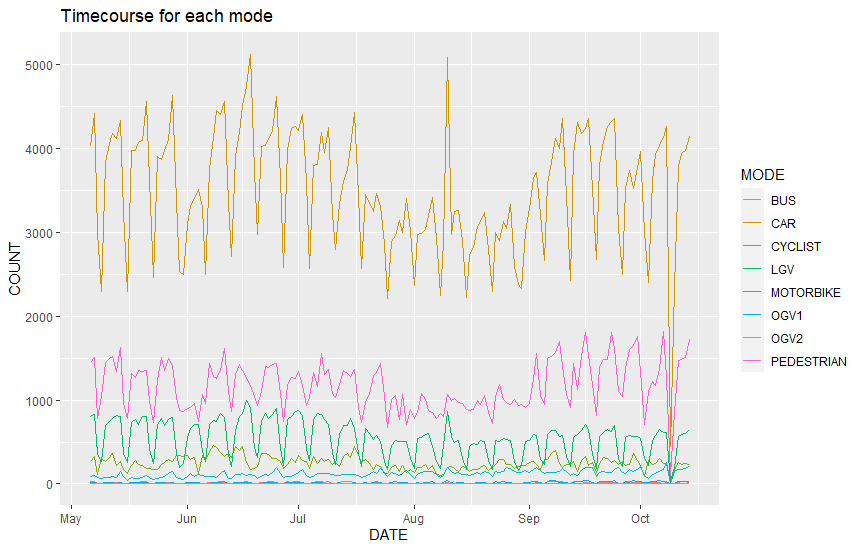
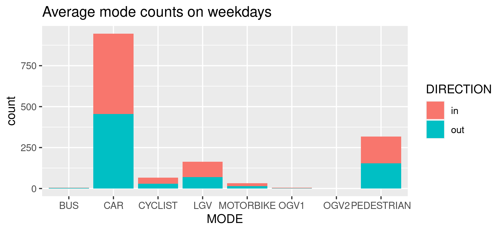
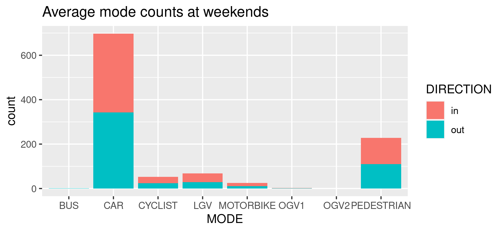

# Innovate Traffic Data

Basic processing of traffic data from the [Innovate Project](https://www.innovateproject.org/).

A full map of the sensors involved in this project can be found [here](https://rbk.maps.arcgis.com/apps/dashboards/46867efa3203492a93348ba04ea23f08)

## Figures

Time course of total transport by each mode passing the Butter Hill traffic sensor.

---

Average mode share on week days.

---

Average mode share at weekends.

